# 💳 CrediYa S.A.S.

## Sistema de Gestión de Créditos

CrediYa S.A.S. es un sistema desarrollado en **Java** para gestionar clientes, empleados, préstamos y pagos de una empresa de créditos.

El sistema permite registrar y consultar información, administrar préstamos, registrar pagos, actualizar automáticamente el saldo pendiente y generar diferentes reportes utilizando **Lambda y Stream de Java**.

Además, el proyecto integra una base de datos **MySQL** con una aplicación Java mediante **JDBC**, y utiliza archivos `.txt` como mecanismo adicional de persistencia de información.

---

#  Tabla de contenidos

- [Descripción del proyecto](#-descripción-del-proyecto)
- [Objetivos](#-objetivos)
- [Funcionalidades](#-funcionalidades)
- [Tecnologías y herramientas](#-tecnologías-y-herramientas)
- [Arquitectura del proyecto](#-arquitectura-del-proyecto)
- [Estructura del proyecto](#-estructura-del-proyecto)
- [Conexión Java - MySQL](#-conexión-java---mysql)
- [Patrón DAO](#-patrón-dao)
- [Gestión de préstamos](#-gestión-de-préstamos)
- [Gestión de pagos y transacciones](#-gestión-de-pagos-y-transacciones)
- [Persistencia en archivos](#-persistencia-en-archivos)
- [Lambda y Stream](#-lambda-y-stream)
- [Reportes](#-reportes)
- [Menú principal](#-menú-principal)
- [Base de datos](#-base-de-datos)
- [Evidencias](#-evidencias)
- [Instalación y ejecución](#-instalación-y-ejecución)
- [Pruebas realizadas](#-pruebas-realizadas)
- [Autores](#-autores)

---

# 📖 Descripción del proyecto

CrediYa permite administrar el proceso básico de una empresa dedicada a otorgar créditos.

El sistema permite:

- Registrar empleados.
- Registrar clientes.
- Registrar préstamos.
- Consultar clientes.
- Consultar préstamos.
- Registrar pagos.
- Consultar el histórico de pagos.
- Actualizar automáticamente el saldo pendiente de los préstamos.
- Identificar préstamos pendientes.
- Identificar préstamos pagados.
- Identificar clientes morosos.
- Validar que los pagos sean correctos.
- Manejar transacciones mediante `commit` y `rollback`.
- Guardar información adicionalmente en archivos `.txt`.

---

#  Objetivos

## Objetivo general

Desarrollar un sistema de gestión de créditos utilizando Java, MySQL y diferentes conceptos de programación orientada a objetos, persistencia de datos, JDBC, Lambda y Stream.

## Objetivos específicos

- Aplicar programación orientada a objetos.
- Implementar conexión entre Java y MySQL mediante JDBC.
- Utilizar el patrón DAO para separar el acceso a datos de la lógica de la aplicación.
- Implementar operaciones CRUD y consultas sobre la base de datos.
- Gestionar préstamos y pagos.
- Actualizar automáticamente los saldos pendientes.
- Implementar transacciones utilizando `commit()` y `rollback()`.
- Utilizar expresiones Lambda y Stream para generar reportes.
- Implementar persistencia adicional mediante archivos de texto.
- Aplicar validaciones para evitar datos incorrectos.

---

#  Funcionalidades

##  Gestión de empleados

Permite registrar empleados con la siguiente información:

- ID
- Nombre
- Documento
- Rol
- Correo
- Salario

Los empleados son almacenados en MySQL y también se genera el archivo:

```text
empleados.txt
```

---

##  Gestión de clientes

Permite registrar clientes con:

- ID
- Nombre
- Documento
- Correo
- Teléfono

Los clientes se almacenan en MySQL y adicionalmente en:

```text
clientes.txt
```

También es posible consultar los clientes registrados.

---

##  Gestión de préstamos

Permite registrar préstamos asociados a un cliente y a un empleado.

Cada préstamo contiene:

- ID
- ID del cliente
- ID del empleado
- Monto
- Interés
- Número de cuotas
- Fecha de inicio
- Estado
- Saldo pendiente

Al crear un préstamo se calcula el saldo inicial utilizando la lógica implementada en la clase `Prestamo`.

El préstamo se almacena en:

```text
MySQL
```

y también en:

```text
prestamos.txt
```

Además, el ID generado automáticamente por MySQL se recupera mediante JDBC y se asigna al objeto Java.

---

#  Gestión de pagos

El sistema permite registrar pagos asociados a un préstamo.

Cada pago contiene:

- ID
- ID del préstamo
- Fecha del pago
- Monto

Cuando se registra un pago:

1. Se consulta el saldo actual del préstamo.
2. Se valida que el préstamo exista.
3. Se valida que el monto sea mayor que cero.
4. Se valida que el pago no supere el saldo pendiente.
5. Se registra el pago.
6. Se actualiza el saldo del préstamo.
7. Se confirma la transacción mediante `commit()`.
8. Se guarda el pago en `pagos.txt`.

---

# 🔌 Conexión Java - MySQL

La conexión entre Java y MySQL se realiza mediante **JDBC (Java Database Connectivity)**.

El proyecto utiliza una clase:

```text
ConexionBD
```

que se encarga de establecer la conexión con la base de datos.

El flujo general es:

```text
Usuario
   │
   ▼
Menu.java
   │
   ▼
DAO
   │
   ▼
ConexionBD
   │
   ▼
JDBC
   │
   ▼
MySQL
```

Por ejemplo, cuando se registra un cliente:

```text
Usuario
   ↓
registrarCliente()
   ↓
ClienteDAO.insertar()
   ↓
ConexionBD.conectar()
   ↓
PreparedStatement
   ↓
INSERT INTO clientes
   ↓
MySQL
```

De esta forma, Java se comunica directamente con MySQL mediante consultas SQL ejecutadas a través de JDBC.

---

#  Patrón DAO

El proyecto utiliza el patrón **DAO (Data Access Object)** para organizar el acceso a la base de datos.

Los principales DAO son:

```text
ClienteDAO
EmpleadoDAO
PrestamoDAO
PagoDAO
```

Cada DAO se encarga de realizar las operaciones relacionadas con su entidad.

Por ejemplo:

```text
Cliente
   ↓
ClienteDAO
   ↓
Tabla clientes
```

```text
Empleado
   ↓
EmpleadoDAO
   ↓
Tabla empleados
```

```text
Prestamo
   ↓
PrestamoDAO
   ↓
Tabla prestamos
```

```text
Pago
   ↓
PagoDAO
   ↓
Tabla pagos
```

Esto permite separar la lógica de acceso a datos de la interfaz del menú.

---

# 🔄 Gestión de préstamos

Cuando se registra un préstamo, Java crea un objeto:

```java
Prestamo prestamo = new Prestamo();
```

Luego se establecen sus datos:

```java
prestamo.setClienteId(clienteId);
prestamo.setEmpleadoId(empleadoId);
prestamo.setMonto(monto);
prestamo.setInteres(interes);
prestamo.setCuotas(cuotas);
prestamo.setFechaInicio(LocalDate.now());
prestamo.setEstado("pendiente");
```

Posteriormente el objeto se envía al DAO:

```java
prestamoDAO.insertar(prestamo);
```

El DAO ejecuta el `INSERT` en MySQL.

El saldo inicial se calcula y se almacena en:

```text
saldo_pendiente
```

---

#  Gestión de pagos y transacciones

Una de las partes principales del proyecto es la gestión de pagos mediante una **transacción JDBC**.

Antes de realizar las operaciones se desactiva el autocommit:

```java
conexion.setAutoCommit(false);
```

Luego se realizan las operaciones necesarias.

Si todo funciona correctamente:

```java
conexion.commit();
```

Si ocurre un error:

```java
conexion.rollback();
```

El flujo es:

```text
Inicio de transacción
        │
        ▼
Consultar saldo
        │
        ▼
Validar pago
        │
        ▼
Registrar pago
        │
        ▼
Actualizar saldo
        │
        ├───────────────┐
        │               │
     Todo OK          Error
        │               │
        ▼               ▼
     COMMIT          ROLLBACK
        │               │
        ▼               ▼
   Confirmar       Deshacer cambios
```

Esto evita que se registre un pago sin actualizar el préstamo o que se actualice el préstamo sin registrar correctamente el pago.

---

# 💾 Persistencia en archivos

Además de MySQL, el proyecto utiliza archivos de texto como mecanismo adicional de persistencia.

Los archivos utilizados son:

```text
clientes.txt
empleados.txt
prestamos.txt
pagos.txt
```

La clase encargada de esta funcionalidad es:

```text
ArchivoDAO
```

Por ejemplo, después de registrar un cliente:

```text
Cliente
   ↓
ClienteDAO
   ↓
MySQL
   ↓
ArchivoDAO
   ↓
clientes.txt
```

De esta manera se mantiene una copia de la información en archivos de texto.

---

# 🆔 IDs generados por MySQL

Para préstamos y pagos se utiliza la generación automática de IDs de MySQL.

Java solicita las claves generadas utilizando:

```java
Statement.RETURN_GENERATED_KEYS
```

Posteriormente se obtiene el ID mediante:

```java
ResultSet
```

Por ejemplo:

```java
try (ResultSet rs = ps.getGeneratedKeys()) {

    if (rs.next()) {

        int idGenerado = rs.getInt(1);

        prestamo.setId(idGenerado);
    }
}
```

Esto permite que el objeto Java tenga el mismo ID generado por MySQL.

---

# 🧠 Lambda y Stream

Los reportes utilizan **Stream API y expresiones Lambda de Java**.

Por ejemplo, para obtener préstamos pendientes:

```java
prestamos.stream()
        .filter(p -> p.getSaldoPendiente() > 0)
        .forEach(System.out::println);
```

En este caso:

- `stream()` convierte la lista en un flujo.
- `filter()` selecciona los préstamos que cumplen la condición.
- `p -> p.getSaldoPendiente() > 0` es una expresión Lambda.
- `forEach()` recorre los resultados.

---

# 📊 Reportes

El sistema cuenta con los siguientes reportes:

## Préstamos pendientes

Muestra préstamos cuyo saldo pendiente es mayor que cero.

```java
.filter(p -> p.getSaldoPendiente() > 0)
```

## Préstamos pagados

Muestra préstamos cuyo saldo pendiente es igual a cero.

```java
.filter(p -> p.getSaldoPendiente() == 0)
```

## Clientes morosos

El sistema identifica los clientes que tienen préstamos pendientes.

Para esto se utiliza:

```java
.filter(p -> p.getSaldoPendiente() > 0)
.map(Prestamo::getClienteId)
.distinct()
```

El uso de `distinct()` evita mostrar repetidamente al mismo cliente cuando tiene más de un préstamo pendiente.

---

# 🖥️ Menú principal

El sistema cuenta con un menú principal desde el cual se pueden acceder a las diferentes funcionalidades:

```text
=================================
          CREDIYA S.A.S.
     Sistema de Créditos
=================================
1. Registrar empleado
2. Registrar cliente
3. Listar clientes
4. Registrar préstamo
5. Listar préstamos
6. Registrar pago
7. Ver histórico de pagos
8. Reportes
9. Salir
=================================
```

El menú permite interactuar con todo el sistema desde la consola.

---

# 📊 Menú de reportes

El menú de reportes contiene:

```text
=================================
            REPORTES
=================================
1. Préstamos pendientes
2. Préstamos pagados
3. Clientes morosos
4. Volver al menú principal
=================================
```

---

# 🗄️ Base de datos

La base de datos utilizada por el proyecto es:

```text
crediya_db
```

Entre las principales tablas utilizadas se encuentran:

```text
clientes
empleados
prestamos
pagos
```

La tabla `prestamos` contiene una relación con `clientes` mediante una clave foránea.

Por ejemplo:

```text
clientes.id
      │
      │ FK
      ▼
prestamos.cliente_id
```

Esto permite mantener la integridad referencial de los datos.

De igual manera, los préstamos están relacionados con los empleados.

---

# 🏗️ Arquitectura general

La aplicación utiliza una separación por capas:

```text
┌──────────────────────────┐
│          VISTA           │
│          Menu            │
└────────────┬─────────────┘
             │
             ▼
┌──────────────────────────┐
│        MODELO            │
│ Cliente                  │
│ Empleado                 │
│ Prestamo                 │
│ Pago                     │
└────────────┬─────────────┘
             │
             ▼
┌──────────────────────────┐
│       PERSISTENCIA       │
│ ClienteDAO               │
│ EmpleadoDAO              │
│ PrestamoDAO              │
│ PagoDAO                  │
│ ArchivoDAO               │
└────────────┬─────────────┘
             │
       ┌─────┴─────┐
       ▼           ▼
   MySQL        Archivos
   crediya_db   .txt
```

---

# 📁 Estructura del proyecto

La estructura general del proyecto es:

```text
CrediYa/
│
├── src/
│   └── main/
│       └── java/
│           └── com/
│               └── mycompany/
│                   └── crediya/
│                       │
│                       ├── modelo/
│                       │   ├── clases/
│                       │   │   ├── Cliente.java
│                       │   │   ├── Empleado.java
│                       │   │   ├── Prestamo.java
│                       │   │   └── Pago.java
│                       │   │
│                       │   └── persistencia/
│                       │       ├── ConexionBD.java
│                       │       ├── ClienteDAO.java
│                       │       ├── EmpleadoDAO.java
│                       │       ├── PrestamoDAO.java
│                       │       ├── PagoDAO.java
│                       │       └── ArchivoDAO.java
│                       │
│                       └── vista/
│                           └── Menu.java
│
├── clientes.txt
├── empleados.txt
├── prestamos.txt
├── pagos.txt
├── pom.xml
└── README.md
```

---

# 🛠️ Tecnologías y herramientas

## Lenguaje

- **Java**

## Base de datos

- **MySQL**
- **MySQL Workbench**

## Conexión a base de datos

- **JDBC**
- `Connection`
- `PreparedStatement`
- `ResultSet`
- `Statement`

## Gestión del proyecto

- **Maven**

## IDE

- **Apache NetBeans**

## Control de versiones

- **Git**
- **GitHub**

## Programación utilizada

- Programación Orientada a Objetos (POO)
- Encapsulamiento
- Constructores
- Getters y Setters
- Listas
- Lambda
- Stream API
- Manejo de excepciones
- Persistencia de datos
- Patrón DAO
- Transacciones JDBC

##  Gestión de Pagos

CrediYa permite registrar pagos y actualizar automáticamente el saldo de los préstamos.

Al realizar un pago, el sistema:

- Registra el pago en **MySQL** y `pagos.txt`.
- Descuenta el valor del pago del saldo pendiente.
- Cambia automáticamente el estado de `pendiente` a `pagado` cuando el saldo llega a $0.
- Actualiza la información del préstamo en `prestamos.txt`.
- Valida que el pago sea mayor que cero y no supere el saldo pendiente.
- Utiliza transacciones JDBC con `commit` y `rollback`.

###  Cálculos

**Monto total:**

```text
Monto + (Monto × Interés / 100)
```

**Cuota mensual:**

```text
Monto total / Número de cuotas
```

###  Persistencia

El sistema utiliza:

- **Java** para la lógica del sistema.
- **MySQL + JDBC** para la persistencia en base de datos.
- **Archivos TXT** para almacenamiento adicional.
- **POO, colecciones, excepciones y Stream API/Lambda** para el desarrollo de la aplicación.

---

# ▶️ Instalación y ejecución

## 1. Clonar el repositorio

```bash
git clone URL_DEL_REPOSITORIO
```

## 2. Abrir el proyecto

Abrir el proyecto desde **NetBeans**.

## 3. Configurar MySQL

Crear la base de datos:

```sql
CREATE DATABASE crediya_db;
```

Luego crear las tablas correspondientes al proyecto.

## 4. Configurar la conexión

Modificar la clase:

```text
ConexionBD.java
```

con los datos correspondientes al servidor MySQL:

```text
URL
Usuario
Contraseña
```

## 5. Verificar el driver JDBC

El proyecto utiliza el conector de MySQL mediante Maven.

La dependencia se encuentra en:

```text
pom.xml
```

## 6. Ejecutar

Ejecutar la clase:

```text
Menu.java
```

y utilizar el menú principal de CrediYa.

---

#  Pruebas realizadas

Se realizaron pruebas para validar las principales funcionalidades del sistema.

### Empleados

- Registro de empleado válido.
- Validación de campos obligatorios.
- Almacenamiento en MySQL.
- Almacenamiento en `empleados.txt`.

### Clientes

- Registro de cliente.
- Validación de campos.
- Consulta de clientes.
- Almacenamiento en MySQL.
- Almacenamiento en `clientes.txt`.

### Préstamos

- Registro de préstamo.
- Validación del cliente existente.
- Validación del empleado existente.
- Cálculo del saldo inicial.
- Generación automática del ID.
- Almacenamiento en MySQL.
- Almacenamiento en `prestamos.txt`.

### Pagos

- Registro de pago válido.
- Actualización del saldo pendiente.
- Generación automática del ID del pago.
- Validación de monto mayor que cero.
- Validación de pago no superior al saldo.
- Uso de `commit()`.
- Uso de `rollback()`.
- Almacenamiento en `pagos.txt`.

### Reportes

- Préstamos pendientes.
- Préstamos pagados.
- Clientes morosos.
- Uso de Lambda y Stream.

---

# 📸 Evidencias

## 1. Menú principal
<p align="center">
  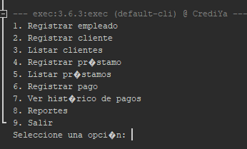
</p>

## 2. Registro de empleado

<p align="center">
  
</p>

## 3. Registro de cliente

<p align="center">
  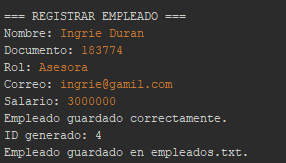
</p>

## 4. Registro de préstamo

<p align="center">
  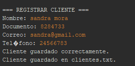
</p>

## 5. Registro de pago

<p align="center">
  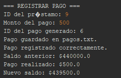
</p>

## 6. Actualización del saldo

<p align="center">
  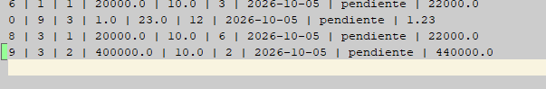
</p>

## 7. Histórico de pagos

<p align="center">
  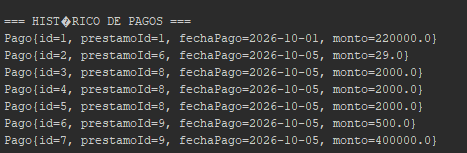
</p>

## 8. Reporte de préstamos pendientes

<p align="center">
  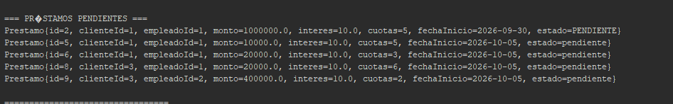
</p>

## 9. Reporte de préstamos pagados

<p align="center">
  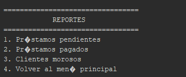
</p>

## 10. Reporte de clientes morosos

<p align="center">
  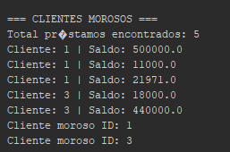
</p>

## 11. Persistencia en archivos

<p align="center">
  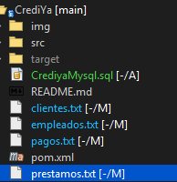
</p>

## 12. Base de datos MySQL

p align="center">
  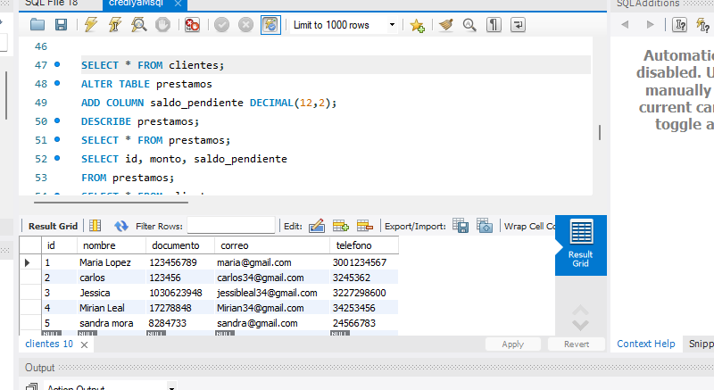
</p><

## Gestion de pagos
p align="center">
  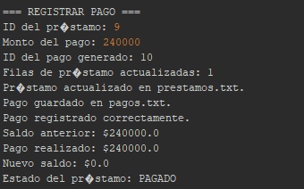
</p>

---

# 🔗 Flujo completo del sistema

El funcionamiento general de CrediYa puede resumirse de la siguiente manera:

```text
                 USUARIO
                    │
                    ▼
              MENU PRINCIPAL
                    │
        ┌───────────┼───────────┐
        ▼           ▼           ▼
    CLIENTES    PRÉSTAMOS     PAGOS
        │           │           │
        ▼           ▼           ▼
      DAO         DAO          DAO
        │           │           │
        └───────────┼───────────┘
                    ▼
               ConexionBD
                    │
                   JDBC
                    │
                    ▼
                  MySQL
                    │
                    ├──────────────┐
                    │              │
                    ▼              ▼
                 Reportes       Archivos
              Lambda/Stream      .txt
```

---

#  Validaciones principales

El sistema incluye validaciones para evitar operaciones incorrectas.

### Préstamos

- El monto debe ser mayor que cero.
- El interés no puede ser negativo.
- El número de cuotas debe ser mayor que cero.
- El cliente debe existir.
- El empleado debe existir.

### Pagos

- El préstamo debe existir.
- El monto debe ser mayor que cero.
- El pago no puede superar el saldo pendiente.
- Si ocurre un error durante la transacción, se ejecuta `rollback()`.

---

# 📌 Conclusión

CrediYa integra diferentes conceptos de desarrollo de software en una aplicación funcional para la gestión de créditos.

El proyecto combina:

```text
Java
+
Programación Orientada a Objetos
+
JDBC
+
MySQL
+
DAO
+
Maven
+
Lambda
+
Stream
+
Transacciones
+
Archivos TXT
+
Git/GitHub
```

La integración entre Java y MySQL permite almacenar y consultar información de forma estructurada, mientras que JDBC permite ejecutar las operaciones SQL desde la aplicación.

La implementación de transacciones garantiza la consistencia de los pagos y la actualización de los saldos.

Finalmente, Lambda y Stream permiten procesar la información para generar reportes como préstamos pendientes, préstamos pagados y clientes morosos.

---


**Proyecto:** CrediYa S.A.S.  
**Tipo:** Sistema de gestión de créditos  
**Lenguaje:** Java  
**Base de datos:** MySQL  
**Control de versiones:** Git / GitHub


# EVALUACION 

puse la validacion de error con try/catch que el monto a apagar noi sea negativo
p align="center">
  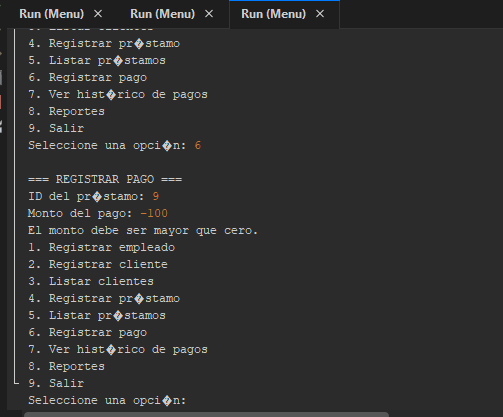
</p><

2. puse listar prestamos mayores al valor que ingrese el cliente 

</p><
